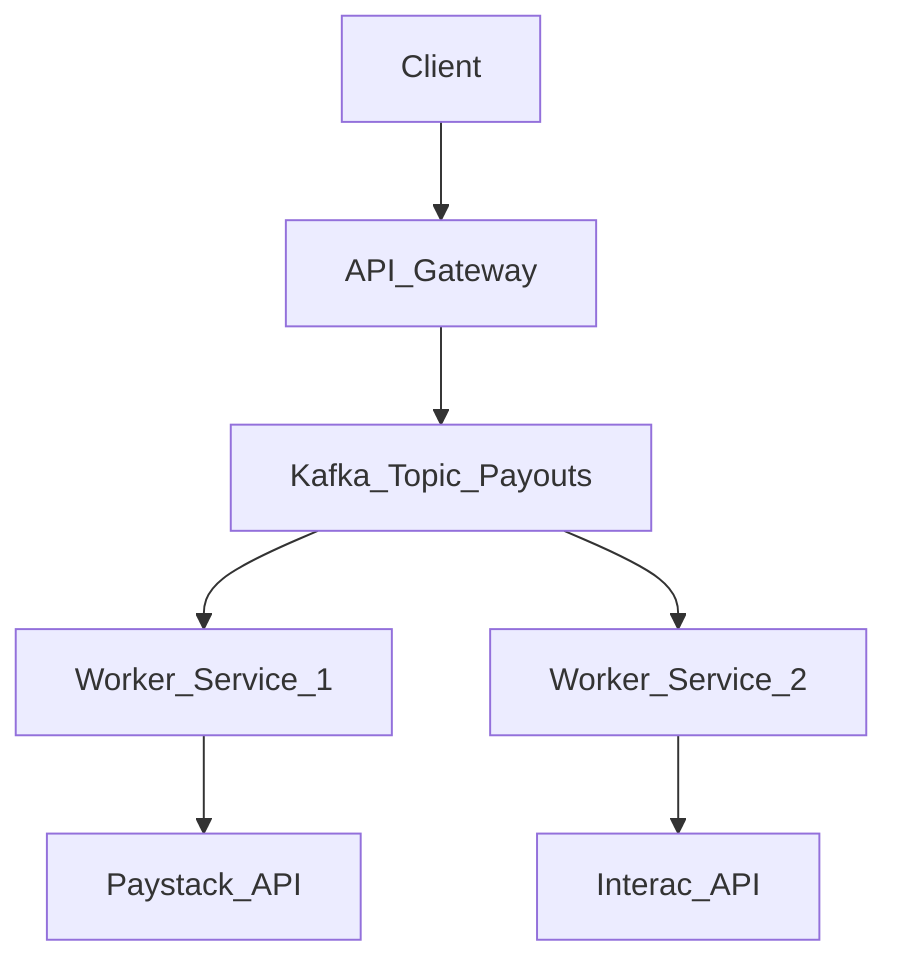

# Architecture Decision Record (ADR) Template

## Title: [Short noun phrase describing the architecture, e.g., "Event-Driven Payout Architecture"]

**Date:** YYYY-MM-DD
**Status:** [Proposed | Accepted | Rejected | Deprecated | Superseded]
**Author:** Joshua Olatunji

---

## 1. Context and Problem Statement
*Describe the technical, business, or operational context. What is the core problem this architecture solves? Be objective and concise. For example: "The current monolithic payout system fails under high concurrency during month-end settlements, causing lock contention in PostgreSQL."*

## 2. Decision Drivers (The "Why")
*What are the forces that are pushing you to make this decision?*
*   High availability requirement (99.99%)
*   Need to integrate with multiple third-party payment gateways (e.g., Paystack, Interac)
*   Strict idempotency requirements to prevent double-spending

## 3. Considered Options
*What other architectures did you consider before settling on the final one?*
*   **Option 1:** Synchronous HTTP calls to payment gateways.
*   **Option 2:** Cron-job batch processing at midnight.
*   **Option 3:** Event-driven architecture using Kafka/RabbitMQ.

## 4. Proposed Solution & Decision
*State the final architectural decision clearly.*

We decided to implement **[Option 3: Event-Driven Architecture using Kafka]**, because it provides the highest resilience against third-party API downtime and ensures guaranteed message delivery without locking the main application database.

### Architecture Diagram
*(Embed a Mermaid diagram here to visualize the system)*

## 5. Trade-offs (Consequences)
*What are the downsides or complexities introduced by this decision? Nothing is perfect.*
*   **Positive:** Complete decoupling of services; high resilience.
*   **Negative:** Increased infrastructure complexity; requires Kafka management.
*   **Negative:** Eventual consistency means the UI must rely on WebSockets or polling to update the user on payout status.

## 6. Implementation Notes
*Any specific details engineers need to know when building this.*
